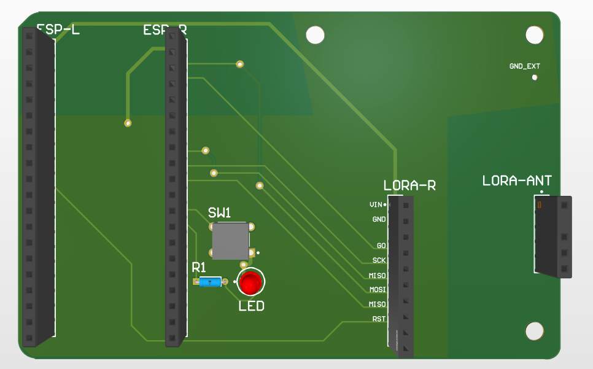
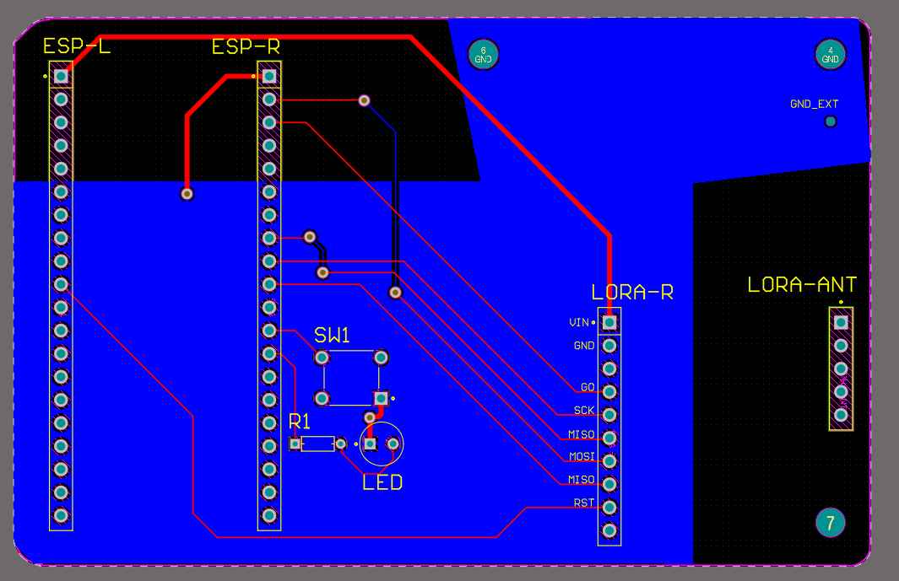
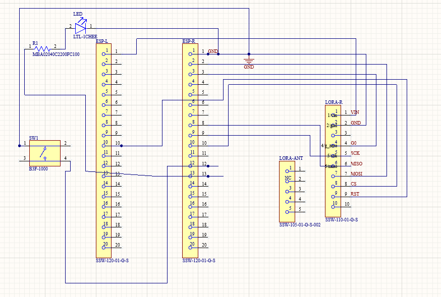

# ARV E-Stop Transmitter PCB
**University of Michigan — ARV Project Team**  
Custom 2-layer PCB for wireless emergency stop (E-Stop) transmitter

---

## Overview

This board implements a handheld wireless E-Stop transmitter for the ARV autonomous robot platform. It interfaces an ESP32 microcontroller with a 900MHz LoRa radio module to transmit an emergency stop signal over >100m range. A switch triggers the E-Stop event, and an LED provides visual status feedback.



---

## Software

### ROS2 Interface
Connected to `embedded_ros_marvin` via serial bridge.

ESP32 → UART serial → serial monitor script → `/tmp/estop_value.txt` → ROS2 `/estop` topic
- **Code** placed in: 

## Hardware

### Why These Parts
- **LoRa (SX1276):** 900MHz, >1km range, low power — chosen over
  WiFi/BT for reliability in outdoor competition environments
- **ESP32:** handles LoRa SPI + ROS2 serial bridge in one package,
  onboard WiFi useful for debugging

| Component | Part | Description |
|---|---|---|
| Microcontroller | ESP32 (via pin headers) | Main controller, SPI master |
| LoRa Radio | Adafruit RFM9x Breakout | 900MHz LoRa transceiver |
| Antenna | TI 915MHz (TI.92.2113) | Omnidirectional 915MHz antenna via SMA |
| Switch | Omron B3F-1000 | Tactile E-Stop trigger |
| Status LED | 3mm LED | Visual power/status indicator |
| Current Limiting Resistor | 220Ω metal film | LED current limiting |
| PCB | 2-layer FR4, 1.6mm, (Top signal + Bottom GND plane) | JLCPCB fabrication |

---
## Mechanical

- All mounting holes: #4-40, 3.175mm diameter.
- See `Project Outputs/fab-drawing.pdf` for dimensioned drawing.
---

## Pin Mapping

### ESP32 → LORA-R (RFM9x)

| ESP32 Pin | LoRa Pin | Function |
|---|---|---|
| GPIO (SCK) | SCK | SPI Clock |
| GPIO (MISO) | MISO | SPI Data In |
| GPIO (MOSI) | MOSI | SPI Data Out |
| GPIO (CS) | CS | Chip Select |
| GPIO | RST | Reset |
| GPIO | G0 | DIO0 / Interrupt |
| 3.3V | VIN | Power |
| GND | GND | Ground |



---

## Design Considerations

**RF / Antenna**
- Antenna operates at 915MHz (LoRa band)
- Copper keepout zone maintained around antenna radiating element to minimize ground plane interference
- SMA connector directly interfaces Adafruit RFM9x breakout to TI.92.2113 antenna — no impedance matching network required due to short connection length
- Adafruit breakout handles internal RF routing and matching to the RFM9x module

**Power**
- Board powered via ESP32 3.3V rail
- LoRa module powered from same 3.3V supply through VIN pin
- No dedicated power regulation on this PCB — relies on ESP32 dev board onboard regulator

**Ground Plane**
- Solid ground pour on bottom layer for signal integrity and noise reduction
- Thermal reliefs on GND through-hole pads for solderability
- Ground plane intentionally removed in antenna keepout region

**LED Circuit**
- GPIO → 220Ω (R1) → LED anode → LED cathode → GND
- At 3.3V supply with 2.0V LED forward voltage: $I = \frac{3.3-2.0}{220} \approx 5.9\text{mA}$
- Within safe operating range for standard 3mm LED (20mA max)

---

## Expected Performance

| Metric | Expected Value |
|---|---|
| Operating Frequency | 915 MHz |
| Modulation | LoRa (chirp spread spectrum) |
| Typical Range (open field) | 300m – 1km depending on spreading factor |
| Supply Voltage | 3.3V |
| LED Current | ~6mA |
| Board Dimensions | See PCB files |

> **Note:** Actual range dependent on firmware spreading factor, transmit power settings, and environment. LoRa range degrades significantly in urban/indoor environments with multipath interference.

---

## Repository Structure

```
arv-e_stop-pcb/
├── transmitter.SchDoc        # Altium schematic
├── transmitter.PcbDoc        # Altium PCB layout
├── lora_transmitter.PrjPcb   # Altium project file
├── Project Outputs/          # Generated Gerber + drill files
│   ├── Gerber/
│   └── NC Drill/
└── README.md
```

---

## Known Limitations & Future Work

- No onboard power regulation — dependent on ESP32 dev board
- No hardware debounce on SW1 — must be handled in firmware
- Keepout zone is smaller than theoretical λ/4 at 915MHz (~82mm) due to board size constraints

---

## Credits

- **ARV Project Team — University of Michigan**
- Contributors :  [@yourusername](https://github.com/yourusername)
- Developed: September 2025 - March 2026
- Last Modified: March 14, 2026

---

## License

MIT license for redistribution. 
